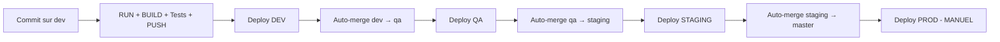

# Documentation Pipeline Jenkins - Movie Cast Application.

## Vue d'ensemble du projet

Cette documentation présente le pipeline CI/CD Jenkins mis en place pour l'application Movie Cast, une application microservices composée de services de gestion de films et de casting. Le pipeline automatise le processus de build, test, déploiement et promotion entre les différents environnements.

##  Architecture de la solution


###  Structure des Charts

```text
charts/
├── Chart.yaml
├── README.md
├── templates
│   ├── _helpers.tpl
│   ├── cast-db-deployment.yaml
│   ├── cast-db-service.yaml
│   ├── cast-service-deployment.yaml
│   ├── cast-service-pvc.yaml
│   ├── cast-service-service.yaml
│   ├── ingress.yaml
│   ├── movie-db-deployment.yaml
│   ├── movie-db-service.yaml
│   ├── movie-service-deployment.yaml
│   ├── movie-service-pvc.yaml
│   ├── movie-service-service.yaml
│   ├── nginx-configmap.yaml
│   ├── nginx-deployment.yaml
│   ├── nginx-service.yaml
│   └── tests
└── values.yaml
```

### Applications déployées

L'application **Movie Cast** est composée de plusieurs services :

-   **movie-service** : Service de gestion des films (API REST)
-   **cast-service** : Service de gestion du casting (API REST)
-   **movie-db** : Base de données PostgreSQL pour les films
-   **cast-db**: Base de données PostgreSQL pour le casting
-   **web** : Serveur web Nginx pour la partie front-end


### Infrastructure technique

-   **🐳 Docker & Docker Hub**  - Conteneurisation et registre d'images
-   **☸️ Kubernetes**  - Orchestration avec namespaces dédiés
-   **Helm Charts**  - Gestionnaire de packages Kubernetes
-   **Jenkis **  - Automatisation complète du pipeline

##  Architecture des environnements

### Les environnements disponibles :
## Environnements disponibles


| Environnement | Description                | URL d'accès                        | Déclenchement                      |
|---------------|----------------------------|--------------------------------------|-------------------------------------|
|  **DEV**    | Développement et tests      | `dev.movie-cast.ip-ddns.com`            |  Automatique *(branche `dev`)*    |
|  **QA**     | Assurance qualité           | `qa.smovie-cast.ip-ddns.com`            |  Automatique après **DEV**        |
|  **STAGING**| Pré-production              | `staging.movie-cast.ip-ddns.com`        |  Automatique après **QA**         |
|  **PROD**   | Production                  | `movie-cast.ip-ddns.com`                |  Manuel uniquement                |

## Pipeline CI/CD détaillé

### Credentials requis
| Credential | Description | Usage |
|------------|-------------|-------|
| `DOCKER_LOGIN` | Identifiants Docker Hub | Push images |
| `MOVIE_DB_LOGIN` | DB Movies credentials | Configuration BDD |
| `CAST_DB_LOGIN` | DB Cast credentials | Configuration BDD |
| `KUBE_CONFIG` | Configuration Kubernetes | Déploiement |
| `GITHUB_TOKEN` | Token GitHub CI Bot | Auto-merge |


### Phase 1 : Initialisation (INIT)
```yaml
Préparation de l'environnement
├── commit_sha: Récupération hash court du commit
├── docker_tag: Génération tag unique v.{BUILD_ID}.{commit_sha}
└── cleanup: Nettoyage conteneurs existants
```
- Génération d'identifiants uniques pour traçabilité
- Préparation environnement propre

### Phase 2 : Construction (BUILD)
```yaml
Construction des images Docker
├── movie-service: dos7/movie-cast:movie-{docker_tag}
├── cast-service: dos7/movie-cast:cast-{docker_tag}
├── movie-db: dos7/movie-cast:movie-db-{docker_tag}
├── cast-db: dos7/movie-cast:cast-db-{docker_tag}
└── web: dos7/movie-cast:web-{docker_tag}
```
- Tags uniques basés sur build ID + commit
- Images optimisées pour production

### Phase 3 : Vérification (RUN)
```yaml
Test de démarrage des services
├── Réseau: Création movie-cast-net
├── Bases: Démarrage PostgreSQL + healthcheck
├── APIs: Lancement services + validation endpoints
└── Frontend: Serveur Nginx + tests connectivité
```
- Validation complète de la stack applicative
- Tests de santé automatisés

### Phase 4 : Tests (TEST)
```yaml
Validation fonctionnelle
├── Health check: Vérification bases de données
├── API docs: Test endpoints documentation
│   ├── /api/v1/movies/docs
│   └── /api/v1/casts/docs
└── Connectivity: Validation réseau inter-services
```
- Tests d'intégration complets
- Validation des APIs REST

### Phase 5 : Publication (PUSH)
```yaml
Envoi vers Docker Hub
├── Authentification: Login sécurisé Docker Hub
├── Push: Toutes images avec tags uniques
└── Conditions: Branches dev, qa, staging, master uniquement
```
- Publication conditionnelle selon branche
- Conservation historique des versions

##  Déploiement intelligent

### Workflow automatisé


###  Déploiement DEV
```yaml
Environnement de développement
├── Namespace: dev
├── Trigger: Push sur branche dev
├── Validation: Tests automatiques
└── Success: Auto-merge vers qa
```

###  Déploiement QA
```yaml
Environnement d'assurance qualité
├── Namespace: qa
├── Trigger: Auto-merge depuis dev
├── Validation: Tests d'intégration
└── Success: Auto-merge vers staging
```

###  Déploiement STAGING
```yaml
Environnement de pré-production
├── Namespace: staging
├── Trigger: Auto-merge depuis qa
├── Validation: Tests de performance
└── Success: Auto-merge vers master
```

### Déploiement PRODUCTION
```yaml
Environnement de production
├── Namespace: prod
├── Trigger: Branche master
├── Validation:  MANUELLE (15min timeout)
└── Deploy: Après confirmation humaine
```

## Fonctions techniques

### `deployToHelm(namespace)`
```yaml
Déploiement Helm automatisé
├── Config: Setup kubeconfig depuis credentials
├── Values: Copie et personnalisation values.yaml
├── Helm: upgrade --install avec paramètres dynamiques
├── Monitor: Vérification status pods
└── Cleanup: Nettoyage fichiers temporaires
```

**Paramètres Helm injectés** :
- Images et tags des microservices
- Configuration environnement
- Namespace de déploiement
- Variables de bases de données

### `autoMergeToNextEnvironment(source, target)`
```yaml
Promotion automatique entre branches
├── Git config: Configuration CI Bot
├── Fetch: Synchronisation branches distantes
├── Branch check: Vérification existence branche cible
├── Merge: No-fast-forward avec message automatique
├── Conflict: Gestion et affichage des conflits
└── Push: Envoi vers GitHub avec token
```

##  Stratégie de promotion

### Flux de promotion automatique
```
dev (auto) → qa (auto) → staging (auto) → master → prod (manuel)
```

### Gestion des conflits
- **Détection automatique** des conflits de merge
- **Arrêt du pipeline** avec détails des fichiers impactés
- **Résolution manuelle** requise avant continuation

##  Sécurité et bonnes pratiques

### Isolation des environnements
- **Namespaces Kubernetes** dédiés par environnement
- **Credentials séparés** par service
- **Réseaux isolés** via Docker networks

### Traçabilité
- **Tags sémantiques** : `v.{BUILD_ID}.{COMMIT_SHORT}`
- **Logs détaillés** à chaque étape
- **Historique complet** des déploiements

### Validation progressive
- **Tests unitaires** en développement
- **Tests d'intégration** en QA
- **Tests de performance** en staging
- **Validation manuelle** en production

## 🧹 Nettoyage automatique

### Post-actions systématiques
```yaml
Nettoyage après pipeline
├── Conteneurs: Arrêt et suppression
├── Images: Conservation tagged uniquement
├── Réseaux: Suppression réseaux temporaires
└── Fichiers: Nettoyage kubeconfig temporaires
```

## Monitoring et observabilité

### Métriques de santé
- **Status des pods** Kubernetes
- **Santé des bases de données** PostgreSQL
- **Disponibilité des APIs** REST
- **Performance des déploiements**

### Logs structurés
- **Étapes du pipeline** avec timestamps
- **Résultats des tests** avec détails
- **Erreurs et stack traces** complètes
- **Métriques de performance**

##  Prérequis techniques

### Infrastructure Jenkins
```yaml
Plugins requis
├── Pipeline: Support Jenkinsfile
├── Git: Intégration SCM
├── Docker Pipeline: Support containers
├── Kubernetes CLI: Déploiement K8s
└── Credentials: Gestion sécurisée
```

### Outils sur agents
```yaml
Binaires installés
├── helm: v3.x minimum
├── kubectl: Compatible cluster
├── docker: Accès daemon
└── git: Client Git récent
```

## Résultats et bénéfices

### Pour l'équipe de développement
- ✅ **Déploiement automatique** dès validation du code
- ✅ **Feedback immédiat** sur la qualité
- ✅ **Environnements synchronisés** en permanence
- ✅ **Tests continus** à chaque commit

### Pour l'équipe QA
- ✅ **Environnement stable** et prévisible  
- ✅ **Tests sur réplique production**
- ✅ **Traçabilité complète** des changements
- ✅ **Validation multicouche** progressive

### Pour la production
- ✅ **Validation multicouche** avant déploiement
- ✅ **Contrôle manuel** pour sécurité maximale
- ✅ **Rollback rapide** via Helm
- ✅ **Monitoring intégré** des déploiements
